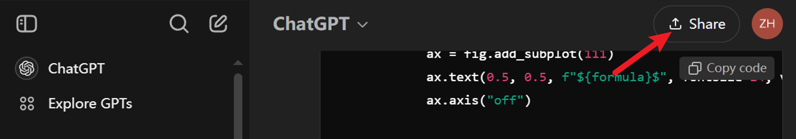
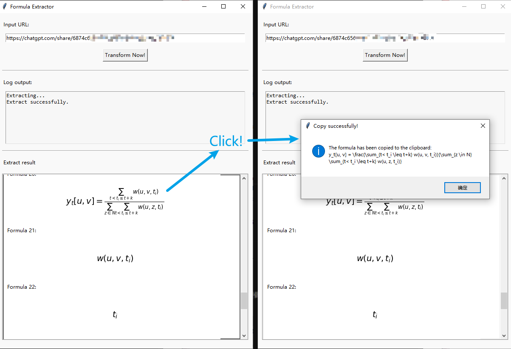

# Math formulat Extractor

An easy tool for extract the formula from the website.

## Math formula for ChatGPT

When we talk to chatGPT, it will output some math formula and rendered by Katex. So it's difficult for us to copy the formula and use it in our paper.

So this tool provides a method to extract the formula easily.

### Usage

1. Talk to ChatGPT. And, you will find it outputs some math formula.

2. Share this conversation, which can make your talks public.

<div align=center>
    
</div>


<div align=center>
    
</div>

3. Use command: ```python run.sh``` or download the exe file from Releases to obtain the program (Only for Windows).

4. Copy the link and input it to the URL textbox, then check the button of "Transform Now!"

5. You will get the original formula with markdown/latex after 20 ~ seconds (due to your network). Click the formula to copy it!

<div align=center>
    
</div>

### FAQ

1. Get the error: About MSEdgeDriver, which can't be found.

    You can download the driver from [this website](https://developer.microsoft.com/en-us/microsoft-edge/tools/webdriver) (Recommand using Chrome to open it), and add it to your enviroment PATH.
